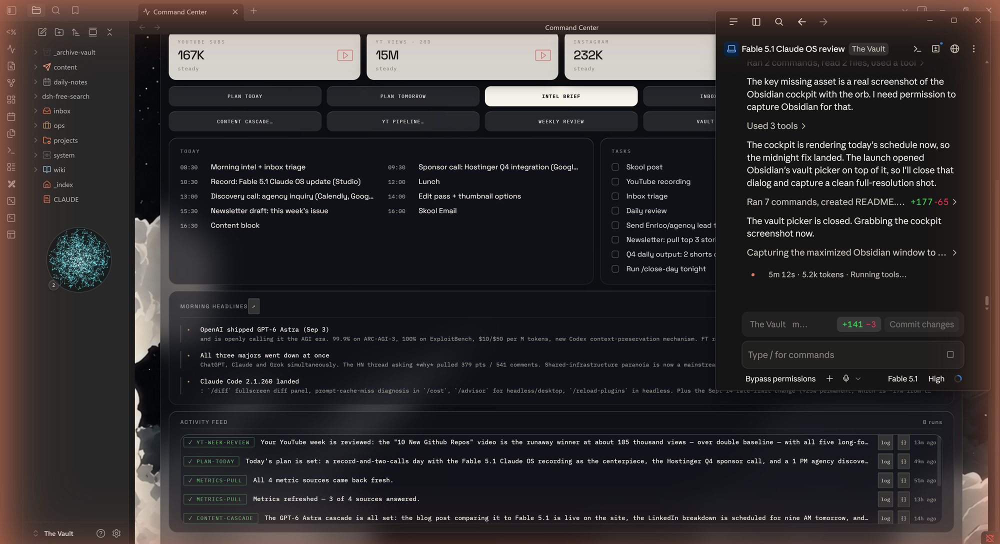
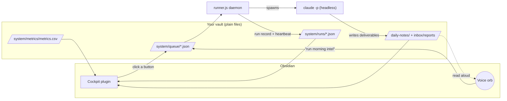
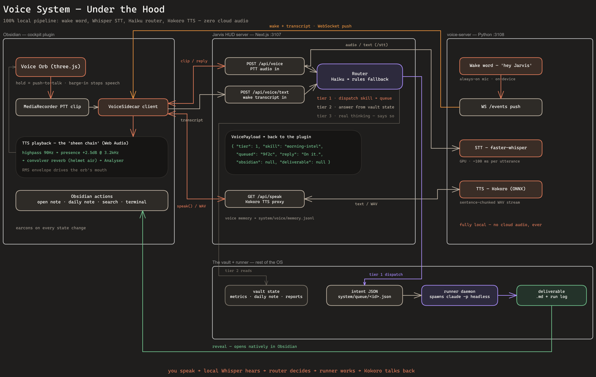

<div align="center">

<pre>
  █████╗  ██████╗ ███████╗███╗   ██╗████████╗██╗ ██████╗      ██████╗ ███████╗
 ██╔══██╗██╔════╝ ██╔════╝████╗  ██║╚══██╔══╝██║██╔════╝     ██╔═══██╗██╔════╝
 ███████║██║  ███╗█████╗  ██╔██╗ ██║   ██║   ██║██║          ██║   ██║███████╗
 ██╔══██║██║   ██║██╔══╝  ██║╚██╗██║   ██║   ██║██║          ██║   ██║╚════██║
 ██║  ██║╚██████╔╝███████╗██║ ╚████║   ██║   ██║╚██████╗     ╚██████╔╝███████║
 ╚═╝  ╚═╝ ╚═════╝ ╚══════╝╚═╝  ╚═══╝   ╚═╝   ╚═╝ ╚═════╝      ╚═════╝ ╚══════╝
</pre>

**Claude Code × Obsidian, packaged as a command center.**
A cockpit, a runner, a skill fleet, and a fully local voice — installed with one word.

[](#quick-start)
[](docs/setup-windows.md)
[](docs/setup-mac.md)
[](#what-you-get)
[](#voice-mode)

<br/>



<sub>The cockpit, live inside Obsidian. Every card is the output of a skill you can read and edit.</sub>

</div>

<br/>

## Quick start

```bash
git clone https://github.com/ctskool/agentic-os-starter.git && cd agentic-os-starter
claude
```

Then type **`/setup-agentic-os`** and hit enter.

Claude takes it from there: checks your machine, runs the installer for your platform, personalizes it to you, walks you through API keys and MCP auth without ever seeing a secret, verifies every layer end to end, and hands you a working cockpit. Pointing it at an **existing Obsidian vault is fine**, nothing you already have gets overwritten. If anything breaks later, run `/setup-agentic-os` again: it doubles as the doctor and skips straight to diagnosis.

You need [Obsidian](https://obsidian.md) and [Claude Code](https://claude.com/claude-code) installed and logged in first. Claude handles, or walks you through, the rest.

<br/>

## What you get

| | | |
|:--|:--|:--|
| 🛸 **The Cockpit** | A pre-built Obsidian plugin, no compile step. Live metric cards, radial arcs, today's schedule and Top 3, a run feed, and one-click buttons that queue AI skill runs. | `plugin/` |
| 🗂️ **The Vault template** | The Karpathy 3-stage structure (`inbox → projects → content` + `wiki`), the frozen daily-note schema, Bases sidebar views, and the machine-readable `system/` plumbing the cockpit reads. | `vault-template/` |
| ⚙️ **The Runner** | A zero-dependency Node daemon. Watches `system/queue/`, spawns headless `claude -p` runs three at a time, writes results and a heartbeat the cockpit displays. Background runs pin to Sonnet so your default model never burns on automations. | `runner/` |
| 🧰 **The Skills** | The daily loop, as editable markdown: `/today`, `/plan-today`, `/close-day`, `/plan-tomorrow`, `/morning-intel`, `/inbox-brief`, `/metrics-pull`, `/github-trending`, `/weekly-review`, `/vault-cleanup`, `/harvest`. | `skills/` `skills-vault/` |
| 🎙️ **Voice mode** *(optional)* | The orb talks. Push-to-talk STT (faster-whisper) and spoken replies (Kokoro TTS), 100% local and free, no API keys. Works from any app with a global hotkey while Obsidian sits minimized. | `voice/` |

<br/>

## How the pieces talk

Files are the message bus. Nothing here needs a database or a server you have to babysit.



1. You click a cockpit button, or say the skill's name to the orb. The plugin writes an intent JSON to `system/queue/`.
2. The runner picks it up, builds the skill prompt, and spawns `claude -p` headless with your vault as the working directory.
3. The skill writes its deliverable into the vault. The runner records the run in `system/runs/`, which the cockpit renders in its feed and the orb announces.
4. Independently, a scheduled metrics pull appends to `system/metrics/metrics.csv` every 6 hours, which drives the metric cards.

The daily-note format is a **frozen parser contract** (`system/schemas/daily-note.md`, v1). The plugin parses those exact headings. Customize content, not section names.

<br/>

## Voice mode

<div align="center">

</div>

You speak. Local Whisper hears. A small router decides which of three tiers the ask belongs to. Kokoro talks back. No cloud audio, ever.

| Tier | What it does | Latency |
|:--|:--|:--|
| **1 · Dispatch** | "Run the intel brief" queues a skill and confirms. | instant |
| **2 · Answer** | "What's my biggest thing today?" reads the vault state you already have: schedule, metrics, reports, Top 3. | ~1s |
| **3 · Delegate** | "Go research X and draft a plan" spawns a real headless Claude run and speaks the summary when it lands. | minutes |

Say **"use fable"** or **"use opus"** inside a tier-3 ask to escalate that one run past the Sonnet default.

Push-to-talk is the default. The wake word ships off because speaker bleed makes hands-free talk over its own replies. Set `WAKE_WORD=on` in `~/.claude/.env` if you use a headset. Models download once (~350MB); GPU is optional, CPU int8 works.

<br/>

## Customizing

- **Vault conventions** live in `vault-template/CLAUDE.md`, which becomes your vault's `CLAUDE.md`. It's the source of truth Claude reads every session: the folder map, the navigation pattern, the writers table.
- **Background model** is `AGENTIC_OS_MODEL` in `~/.claude/.env` (default `sonnet`, keep it cheap). Escalate single runs by voice instead of raising the default.
- **Skills** are folders with a `SKILL.md`. Edit the prompts freely, they're markdown. Every skill here is a working example: read one, copy its shape, and use `/skill-creator` in Claude Code to scaffold and test your own.
- **Metrics sources** with blank keys are skipped gracefully. The cockpit shows per-source status instead of crashing.

<br/>

<details>
<summary><b>Manual install</b> (if you'd rather not let Claude drive)</summary>

<br/>

**Mac / Linux**

```bash
bash install.sh
```

**Windows**

```powershell
powershell -ExecutionPolicy Bypass -File .\install.ps1
```

The installer asks where you want the vault, copies the template without overwriting existing notes, installs the plugin, skills, and runner, creates `~/.claude/.env` from the template, and offers to register autostart (launchd on Mac, a Startup shortcut plus a Task Scheduler job on Windows). Re-running it is safe. Both take non-interactive flags: `--vault <path> --autostart yes` / `-Vault <path> -Autostart yes`.

Then finish with the four steps the installer prints. Full walkthroughs: [docs/setup-mac.md](docs/setup-mac.md) · [docs/setup-windows.md](docs/setup-windows.md).

</details>

<details>
<summary><b>Prerequisites</b></summary>

<br/>

| Requirement | Why |
|:--|:--|
| [Obsidian](https://obsidian.md) | The cockpit lives in it |
| [Claude Code](https://claude.com/claude-code), logged in | Runs every skill; the runner shells `claude -p` |
| Node.js 20+ | The runner daemon (no npm installs needed) |
| Python 3.10+ | Metric pullers and a few skill scripts |

Optional, feature by feature: a YouTube Data API key (channel metrics + morning-intel YouTube scan), Instagram and TikTok handles (follower scrapes), Gmail and Calendar MCP connectors (morning intel + inbox triage).

</details>

<details>
<summary><b>Repo layout</b></summary>

<br/>

```
install.sh / install.ps1   guided installers (idempotent)
.env.example               all secrets/config live in ~/.claude/.env, nothing hardcoded
.claude/skills/            the /setup-agentic-os skill Claude runs from inside this repo
plugin/                    pre-built Obsidian plugin (main.js + manifest + styles)
runner/                    runner.js + per-platform launchers (VBS / shell + launchd plist)
skills/                    global skills → ~/.claude/skills/
skills-vault/              vault-scoped skills → <vault>/.claude/skills/
vault-template/            folder skeleton, CLAUDE.md conventions, schemas, templates, Bases
voice/                     optional voice module: hud-server (:3107) + voice-server (:3108)
docs/                      per-platform setup + assets
```

</details>

<details>
<summary><b>Troubleshooting</b></summary>

<br/>

First move, always: run `/setup-agentic-os` again. It detects an existing install and goes straight to the verify phase.

- **Cockpit shows "runner offline"**: the heartbeat in `system/runner-status.json` is stale. Start it: Mac `bash ~/.claude/agentic-os-runner/start-runner.sh`, Windows double-click `start-runner.vbs`. Read `~/.claude/agentic-os-runner/runner.log`.
- **Buttons queue but nothing happens**: `claude` isn't on the runner's PATH, or you're not logged into Claude Code. Run `claude -p "say hi"` in a terminal to verify.
- **Metric cards empty**: run the pull manually (`run_all.sh` / `run_all.ps1`) and read the newest log in `~/.claude/skills/metrics-pull/logs/`.
- **Gmail/Calendar skills fail auth**: run `claude` inside the vault and `/mcp` to (re)authenticate connectors.
- **Orb says "voice offline"**: the voice servers aren't running. Check `curl http://127.0.0.1:3108/health` and `curl http://127.0.0.1:3107/api/speak`; logs at `voice/voice-server/voice-server.log` and `voice/hud-server/.next-dev.log`. Repair with `voice/install-voice.sh` (Mac) / `voice\install-voice.ps1` (Windows), both idempotent.

</details>

<details>
<summary><b>Known limitations</b></summary>

<br/>

Three cockpit buttons are wired to skills from Chase's extended stack that aren't included here because they depend on infrastructure you'd have to build separately:

- **Cascade** (`content-cascade`) needs a Supabase project and a blog pipeline
- **Deep Research** (`deep-research-chase`) and **YT Pipeline** (`yt-pipeline`) need NotebookLM auth and companion skills

Clicking them queues a run that fails gracefully and shows as failed in the run feed. Nothing breaks. Everything else on the action bar works out of the box.

Windows is verified end to end on a clean install and on an existing vault. The Mac path shares the same code but has had fewer eyes on it. If you run it on a Mac, an issue with what you saw is the most useful thing you can send.

</details>

<br/>

<div align="center">

Built by [Chase AI](https://www.youtube.com/@Chase-H-AI). The full build story is on YouTube: [This Claude Code × Obsidian Agentic OS Will Be The New Meta](https://youtu.be/njHuj8OxIVI).

<sub>Every skill, the runner, and the plugin were built with Claude Code. The point isn't the dashboard. It's that the dashboard is a receipt for the skills underneath.</sub>

</div>
